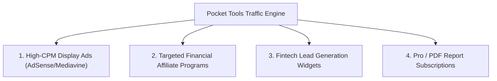
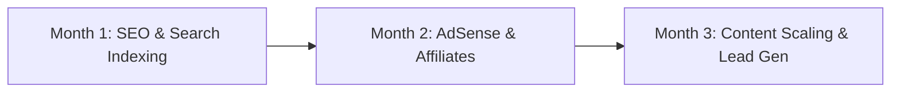

# 💰 POCKET TOOLS — MONETIZATION & INCOME GENERATION BLUEPRINT

> **Comprehensive Business Strategy, Revenue Streams, Affiliate Networks, and 90-Day Execution Roadmap for Scaling Pocket Tools to ₹1,00,000 – ₹3,00,000+ / Month Passive Income.**

---

## 1. Executive Summary: The Utility Website Business Model

Utility and calculator websites (*e.g., OmniCalculator, RapidTables, Calculator.net*) enjoy some of the highest profit margins on the internet:

* **High Intent Search Traffic:** Users search for specific solutions (e.g., *"calculate home loan EMI"*, *"GST 18% on 50,000"*).
* **Zero Inventory & Zero Operational Cost:** Calculations run client-side; server hosting cost is virtually ₹0 on modern platforms like Vercel.
* **High Financial RPM / CPC:** Finance keywords in India & globally command premium advertiser bidding ($2 to $15+ CPM).

---

## 2. Projected Revenue Breakdown (Based on Monthly Traffic)

| Monthly Active Users (Traffic) | Display Ads (AdSense) | Affiliate & Lead Gen | Micro-SaaS (Pro/PDF) | **Total Estimated Monthly Income** |
| :--- | :--- | :--- | :--- | :--- |
| **10,000 visitors** | ₹3,000 – ₹6,000 | ₹10,000 – ₹20,000 | ₹2,000 | **₹15,000 – ₹28,000 / mo** |
| **50,000 visitors** | ₹18,000 – ₹35,000 | ₹40,000 – ₹80,000 | ₹10,000 | **₹68,000 – ₹1,25,000 / mo** |
| **200,000+ visitors** | ₹80,000 – ₹1,50,000 | ₹1,50,000 – ₹3,00,000 | ₹30,000+ | **₹2,60,000 – ₹4,80,000+ / mo** |

---

## 3. The 4 Core Revenue Streams

---

### Revenue Stream 1: High-RPM Display Advertising

* **Primary Networks:** Google AdSense (Initial), Mediavine / Raptive (at 50k+ sessions), Ezoic.
* **Placement Strategy:**
  1. **Top Banner (Under Header):** Clean, non-intrusive 728x90 leaderboard ad.
  2. **In-Content Ad:** Placed directly between the Calculation Results and the "How it Works" section.
  3. **Sidebar / Right Rail Ad:** Sticky 300x250 or 300x600 banner on desktop.
* **Why it Works:** Finance, Tax, and Loan tools have the highest advertiser competition, resulting in maximum cost-per-click (CPC).

---

### Revenue Stream 2: High-Paying Financial & SaaS Affiliate Marketing

Instead of generic ads, contextual affiliate buttons convert at 3–7% higher rates:

| Tool Page | Partner Affiliate Programs | Commission Model | Earning Potential |
| :--- | :--- | :--- | :--- |
| **EMI Calculator** | Paisabazaar, BankBazaar, HDFC Bank, Tata Capital | Per Disbursed Loan / Lead | **₹1,000 – ₹5,000 per Loan** |
| **GST Calculator** | Zoho Books, QuickBooks, TallyPrime, Khatabook | Per Software Sale | **₹1,500 – ₹3,500 per Sale** |
| **SIP & Investment (V2)** | Groww, Zerodha, Upstox, Angel One | Per Demat Account Open | **₹300 – ₹800 per Account** |
| **Password Generator** | NordPass, 1Password, NordVPN, ExpressVPN | Recurring Subscription (40%) | **₹800 – ₹2,500 per Customer** |
| **BMI Calculator** | Cult.fit, HealthifyMe, MyProtein | Per Purchase / App Install | **₹200 – ₹1,200 per Order** |
| **JSON Formatter** | Hostinger, DigitalOcean, Vercel, JetBrains | Per Cloud / Hosting Sign-up | **₹1,500 – ₹5,000 per Sale** |

---

### Revenue Stream 3: Direct Fintech Lead Generation

* **How it works:** When a user enters ₹25,00,000 in the Home Loan EMI calculator, display a high-intent CTA box:
  > *"Compare Lowest Home Loan Rates across 15+ Banks (SBI @ 8.4%, HDFC @ 8.5%)"*
* User submits Name, City, and Mobile Number $\to$ Lead is automatically pushed via webhook to certified DSA / Bank partners.
* **Payout:** ₹250 – ₹600 per verified phone lead.

---

### Revenue Stream 4: Micro-SaaS & Pro Export Features (Future V2)

* **Free Tier:** Instant on-screen calculation, standard copy feature.
* **Pro Tier (₹49/month or ₹299/lifetime):**
  * Export Branded PDF Invoices / Loan Amortization Reports with custom business logos.
  * 100% Ad-Free interface.
  * Downloadable Multi-Year Excel amortization spreadsheets.

---

## 4. 90-Day Execution Roadmap: From Launch to First ₹50,000

### 🗓️ Month 1: Search Console Indexing & Initial Traffic (0 – 5,000 Visitors)
* Submit `https://pockettools-seven.vercel.app/sitemap.xml` to **Google Search Console** and **Bing Webmaster Tools**.
* Connect custom domain (e.g., `pockettools.app` or `pockettools.in`).
* Share on social platforms (Twitter/X build-in-public, Reddit r/webdev, LinkedIn, Product Hunt).

### 🗓️ Month 2: Monetization Activation (5,000 – 25,000 Visitors)
* Apply for **Google AdSense** (Since About, Privacy, and standard UI are complete, approval typically takes 3–7 business days).
* Sign up for **vCommission, Impact Radius, and Cuelinks** (Indian financial affiliate aggregators).
* Add contextual affiliate recommendation cards under GST, EMI, and Password tools.

### 🗓️ Month 3: Scaling & Optimization (25,000 – 100,000+ Visitors)
* Launch **V2 features** (SIP Calculator, Income Tax Regime Calculator, PWA Offline App).
* Target long-tail high-volume search queries (e.g. *"how to calculate GST 18% on gold"*).
* A/B test ad placements to optimize RPM without degrading user experience.

---

## 5. Affiliate Program Registration Links & Checklist

1. **Fintech & Loan Networks:**
   * [vCommission.com](https://www.vcommission.com) (India's leading affiliate network for BFSI/Loans).
   * [Cuelinks.com](https://www.cuelinks.com) (Instant 2-minute setup for all Indian banks & tools).
   * [Paisabazaar Partner Program](https://www.paisabazaar.com).
2. **SaaS & Software Programs:**
   * [Impact.com](https://impact.com) (For NordPass, Canva, hosting providers).
   * [Zoho Affiliate Program](https://www.zoho.com/affiliate.html).
3. **Ad Networks:**
   * [Google AdSense](https://adsense.google.com).
   * [Ezoic Access Now](https://www.ezoic.com).

---

## 6. Golden Rules for Long-Term Success

1. **Prioritize Speed & User Experience:** Never place popups or intrusive ads that block calculator controls.
2. **Transparent Disclaimers:** Keep affiliate disclosures in the footer for trust and compliance.
3. **Continuous SEO Optimization:** Maintain informative FAQs and step-by-step calculation examples for top Google rankings.
