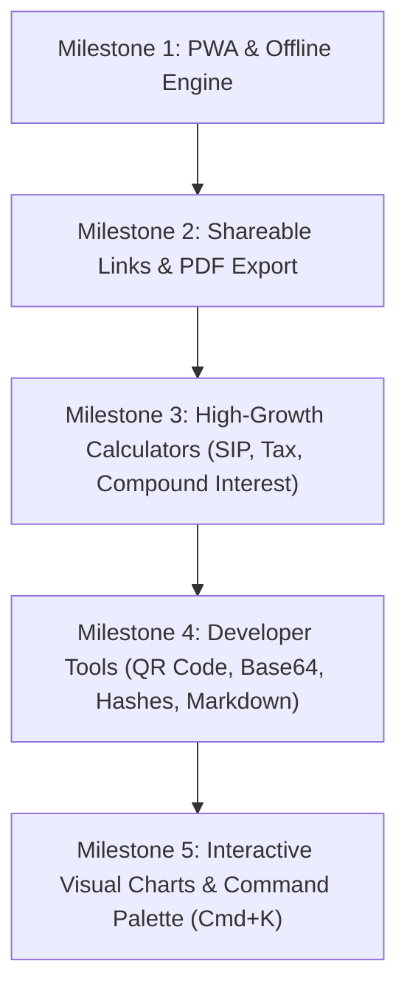

# 🚀 Pocket Tools — Version 2.0 Product & Technical Specification

> **Next-Generation Roadmap: Progressive Web App, Interactive Financial Visualizations, PDF/Share Exports, and High-Traffic Utility Tools.**

---

## 1. Executive Summary & V2 Goals

Pocket Tools V1 successfully delivered a fast, client-side utility suite covering 12 core tools across 6 categories. **Version 2.0 (V2)** focuses on three growth pillars:

1. **User Retention & Offline Native Feel:** Transforming the web app into an installable **Progressive Web App (PWA)** with complete offline support.
2. **Viral Shareability & Utility Export:** Introducing **URL State Sharing** (e.g. sharing calculated GST/EMI via link) and **PDF / Excel summary exports**.
3. **High-Demand Tool Catalog Expansion:** Adding high-traffic financial calculators (SIP, Compound Interest, Income Tax) and developer utilities (Base64, Hash Generator, QR Code).

---

## 2. Core V2 Platform Features

### 2.1 📱 Installable PWA (Progressive Web App)
* **Web App Manifest (`manifest.json`):** Custom icons (192x192, 512x512, maskable), theme colors (`#5B5BF0` / `#101014`), standalone display mode.
* **Service Worker & Offline Cache:** Workbox / Serwist integration allowing 100% functionality on mobile devices without active internet connection.
* **Smart "Add to Home Screen" Banner:** Non-intrusive prompt after second visit or tool calculation.

---

### 2.2 🔗 Shareable URL State Encoding
* **Query Parameter State Sync:** Encode tool parameters into URL hash or query strings (e.g. `/calculators/emi?p=1000000&r=8.5&t=20&u=years`).
* **One-Click Share Button:** Copy link to clipboard, or native Web Share API on mobile to share calculations directly to WhatsApp, Telegram, or Email.

---

### 2.3 📄 PDF & Excel/CSV Amortization Export
* **EMI & Loan Amortization Schedule:** Month-by-month and year-by-year payment schedule with principal vs. interest breakdown.
* **Export Options:**
  * **Download PDF Report:** Clean, branded invoice/report ready to print or email.
  * **Export CSV / Excel:** Structured raw data table for financial planning.

---

### 2.4 📊 Interactive Visual Charts
* **Lightweight Charting Engine (Recharts or Chart.js):**
  * **EMI / Loan Repayment:** Interactive Donut Chart showing Principal vs. Total Interest percentage.
  * **SIP & Compound Interest:** Growth trajectory line/area charts visualizing Invested Amount vs. Wealth Gained over time.
  * **BMI Visual Gauge:** Needle/meter gauge pointing to current BMI health zone.

---

### 2.5 ⌨️ Quick Command Palette (`Cmd + K` / `Ctrl + K`)
* Keyboard-friendly global modal allowing power users to search and jump to any tool in 1 keystroke.

---

### 2.6 🕒 Local Calculation History Drawer
* Slide-over drawer storing the last 15 calculations locally per tool.
* Allows one-click reload of previous calculation inputs without cloud sync or accounts.

---

## 3. New Tools Roadmap for V2

### 💰 Finance & Investment (High Traffic Growth)

| Tool Name | Route | Core Functionality |
| :--- | :--- | :--- |
| **SIP Calculator** | `/calculators/sip` | Systematic Investment Plan future value, total invested, estimated returns, wealth growth chart. |
| **Compound Interest** | `/calculators/compound-interest` | Compounding frequencies (Daily, Monthly, Quarterly, Annually), growth visualizer. |
| **Income Tax Calculator** | `/calculators/income-tax` | Old vs. New Tax Regime comparison (India), tax slab breakdown, rebate applicability. |
| **FD & RD Calculator** | `/calculators/fd-rd` | Fixed Deposit & Recurring Deposit maturity value and interest earnings. |
| **Live Currency Converter** | `/converters/currency` | Real-time exchange rates (USD, INR, EUR, GBP, AED, etc.) using lightweight open exchange rate cache. |

---

### 🛠️ Developer & Power Utilities

| Tool Name | Route | Core Functionality |
| :--- | :--- | :--- |
| **QR Code Generator** | `/developer-tools/qr-code` | Generate custom QR codes for URLs, text, WiFi credentials, vCards with PNG/SVG download. |
| **Base64 Encoder / Decoder** | `/developer-tools/base64` | Convert UTF-8 text and images to Base64 strings and vice versa. |
| **Hash Generator** | `/developer-tools/hash-generator` | Compute MD5, SHA-1, SHA-256, SHA-512 hashes client-side via Web Crypto. |
| **Markdown Previewer** | `/developer-tools/markdown-preview` | Split-screen live Markdown editor with instant HTML render and copy code block support. |
| **Color Code Converter** | `/converters/color` | Convert HEX, RGB, HSL, CMYK with live color picker and contrast checker. |

---

### 🏃 Health & Productivity

| Tool Name | Route | Core Functionality |
| :--- | :--- | :--- |
| **BMR & Calorie Calculator** | `/health/bmr-calorie` | Basal Metabolic Rate and daily maintenance calorie targets based on Mifflin-St Jeor formula. |
| **Pomodoro Timer** | `/productivity/pomodoro` | Customizable 25/5 min focus timer with audio chimes and browser tab notifications. |

---

## 4. Technical Architecture for V2

```text
pocket-tools/
├── app/
│   ├── manifest.ts             # Next.js native Web App Manifest
│   ├── service-worker.ts       # Offline caching strategy
│   └── calculators/
│       ├── sip/page.tsx        # [NEW] SIP Calculator
│       ├── compound-interest/  # [NEW] Compound Interest
│       └── income-tax/         # [NEW] Tax Regime Compare
├── components/
│   ├── charts/                 # [NEW] DonutChart, LineGrowthChart, BMIGauge
│   ├── export/                 # [NEW] PdfExporter, CsvExporter
│   └── navigation/
│       └── CommandPalette.tsx  # [NEW] Cmd+K Global Search
├── lib/
│   ├── calculations/
│   │   ├── sip.ts              # SIP formula engine
│   │   ├── compound-interest.ts# Compound interest math
│   │   └── amortization.ts     # Amortization table generator
│   └── pdf/                    # PDF report templates
```

---

## 5. Suggested Phased V2 Rollout Plan



* **Milestone 1 (PWA & Offline):** Configure web app manifest, app icons, and offline caching.
* **Milestone 2 (Shareable State & Export):** Add URL parameter syncing, one-click WhatsApp/link sharing, and PDF export for EMI/GST.
* **Milestone 3 (Financial Expansion):** Implement SIP, Compound Interest, FD/RD, and Income Tax calculators with unit tests.
* **Milestone 4 (Developer Expansion):** Implement QR Code generator, Base64 converter, and cryptographic hash generator.
* **Milestone 5 (Visuals & Polish):** Add interactive charts, Cmd+K quick palette, and history drawer.

---

## 6. Privacy & Performance Commitment

* **Zero Backend Dependency:** All new tools (including QR code generation, Base64, and PDF creation) will continue to execute **100% inside the browser**.
* **Zero User Tracking:** User inputs and financial calculations remain strictly on the user's local device.
